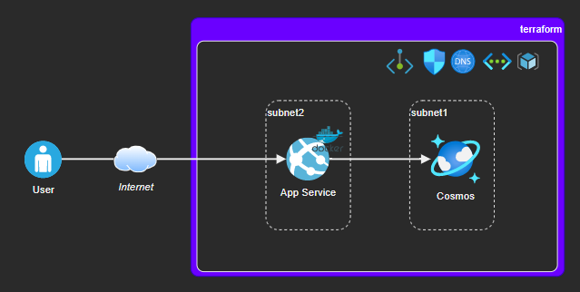

# Azure-Terraform Private Network

A showcase project demonstrating private networks and private endpoints on Azure with Terraform.

- [x] Virtual Network Inbound / Outbound protection (NSG)
- [x] Cosmos DB Network Restrictions
- [x] Cosmos DB Private Endpoints + Standard Private DNS Zone
- [x] App Services



## Running it

Log into Azure with your favorite tool:

```sh
az login
```

Deploy the resources:

```sh
cd ./infrastructure

terraform init
terraform plan
terraform apply -auto-approve
```

This will take a long time.

## API local development

Begin by entering the API module:

```sh
cd ./api
```

### Mongo DB

```bash
docker pull mongo

docker run -d --name mongodb -p 27017:27017 -e MONGO_INITDB_ROOT_USERNAME="app" \
  -e MONGO_INITDB_ROOT_PASSWORD="p4ssw0rd" mongo
```

### Python API

Setup the `.env` file environment variables:

```bash
cp resources/development.env .env
```

Start the app

```bash
# Dependencies
pipenv shell
pipenv install

# App
export FLASK_ENV=development
export FLASK_APP=src/app

python3 -m flask run
```


## Testing with Docker locally

```bash
# pull/build
docker pull mongo
sudo docker build -t big-aztf-app .

# compose up
docker-compose up -d
```
